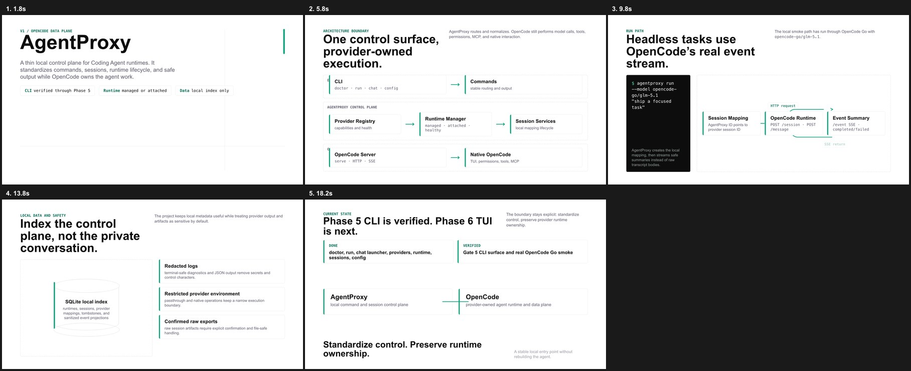
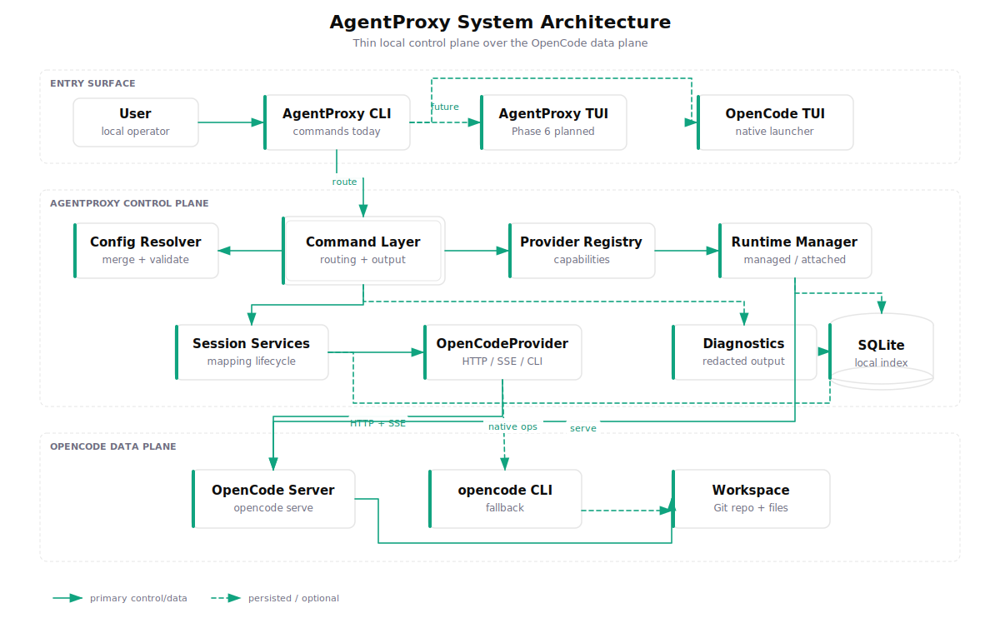
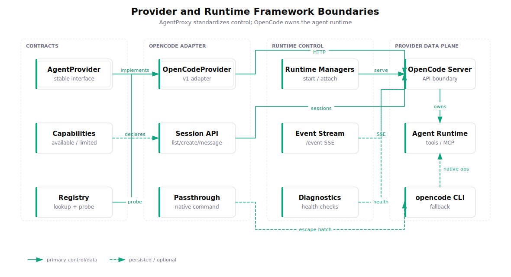
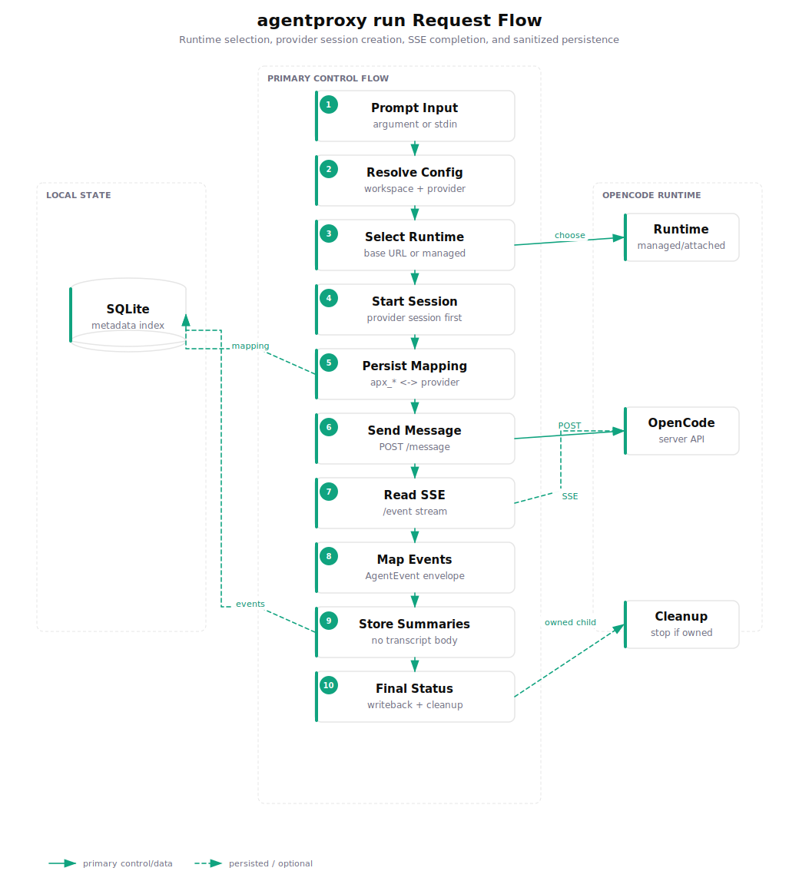
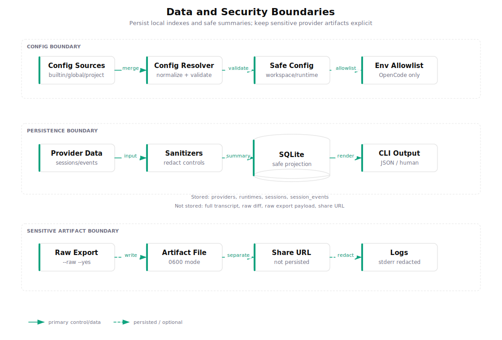

# AgentProxy

AgentProxy 是面向 Coding Agent runtime 的本地薄代理与控制面。v1 只接入 OpenCode：AgentProxy 负责命令入口、配置解析、provider 能力探测、runtime 生命周期、session 索引、诊断输出和安全摘要；OpenCode 继续拥有模型调用、工具执行、MCP、权限、文件编辑、diff、撤销回滚和原生交互体验。

一句话概括：**AgentProxy 是 control plane，OpenCode 是 v1 data plane。**

[](assets/video/agentproxy-intro.mp4)

## 当前状态

| 范围 | 状态 |
| --- | --- |
| Phase 0.2 / Phase 1 / Phase 2 | 已完成：技术决策、TypeScript 工程骨架、核心契约、配置、日志、SQLite 存储 |
| Phase 3 | 已完成：OpenCode binary 探测、managed/attached runtime、事件流、runtime 诊断 |
| Phase 4 | 已完成：OpenCodeProvider health/capability、模型/会话、消息、session 操作、passthrough |
| Phase 5 | 已完成：CLI MVP 命令面与 Gate 5 汇总验证 |
| 真实 smoke | 已完成：本机 `opencode-go/glm-5.1` 路径的 `agentproxy run` 已跑通 |
| Phase 6 | 未开始：AgentProxy 自身 TUI 控制面 |
| Phase 7-9 | 未开始：安全/可观测性增强、CI、文档/打包/发布 |

当前版本是 `0.1.0`。`agentproxy chat` 目前是 OpenCode 原生 TUI launcher，不是 Phase 6 AgentProxy TUI。

## 快速开始

### 前置条件

- Node.js `>=22.0.0`
- pnpm `10.10.0`
- 本机已安装可用的 `opencode` CLI，最低支持版本 `1.0.0`
- OpenCode 自身的模型/provider 凭据已配置好

### 从源码运行

```bash
pnpm install
pnpm run agentproxy -- --help
pnpm run agentproxy -- doctor
```

构建后运行：

```bash
pnpm run build
node dist/index.js --help
node dist/index.js doctor
```

### Headless 任务

```bash
pnpm run agentproxy -- run "只读任务：请用一句话说明当前仓库用途。不要修改任何文件。"
```

指定 OpenCode 暴露的模型 id：

```bash
pnpm run agentproxy -- run --model opencode-go/glm-5.1 "只读任务：请总结当前项目状态。"
```

`--model` 需要使用 provider/model 格式。没有位置参数时，`run` 会从 stdin 读取 prompt：

```bash
printf "总结这个项目" | pnpm run agentproxy -- run --json
```

JSON 输出适合脚本和 CI：

```bash
pnpm run agentproxy -- run --json "只读任务：检查项目是否能构建。"
```

`run` 会创建 provider session、保存 AgentProxy 本地映射、发送 prompt、读取 OpenCode `/event` SSE，并输出或保存安全摘要。它不会把完整 assistant transcript 当作默认 JSON 产物长期保存。

### 打开 OpenCode 原生 TUI

```bash
pnpm run agentproxy -- chat --workspace .
```

该命令把终端交给 OpenCode 原生交互界面。`chat --session <id>` 仍是计划能力。
`chat` 会进行交互式 stdio handoff，因此不支持 `--json`。

## 命令矩阵

| 命令 | 用途 |
| --- | --- |
| `agentproxy doctor` | 检查 Node、配置、SQLite、OpenCode binary/runtime/provider/workspace 健康状态 |
| `agentproxy doctor --managed-smoke` | 启停临时 managed OpenCode runtime 做更完整诊断 |
| `agentproxy run [prompt]` | 通过 AgentProxy 向 OpenCode 发起 headless 任务 |
| `agentproxy chat` | 打开 OpenCode 原生 TUI |
| `agentproxy providers list` | 查看 provider 健康状态、能力和模型摘要 |
| `agentproxy providers inspect opencode` | 查看 OpenCode provider 详细诊断 |
| `agentproxy runtime list` | 查看本地 runtime registry |
| `agentproxy runtime stop <runtime-id>` | 停止当前进程拥有的 managed runtime，或解绑 attached runtime |
| `agentproxy sessions list` | 查看本地 session 索引 |
| `agentproxy sessions show <id>` | 查看单个 AgentProxy session 详情 |
| `agentproxy sessions resume <id> --prompt "..."` | 恢复已索引 session 并可选发送 prompt |
| `agentproxy sessions abort <id>` | 中止 provider session 并写回本地状态 |
| `agentproxy sessions delete <id> --yes` | 删除 provider session 并保留 tombstone |
| `agentproxy sessions export <id> --sanitize` | 导出经过清理的 provider session 数据 |
| `agentproxy sessions export <id> --raw --yes --output <file>` | 显式确认后导出 raw provider artifact |
| `agentproxy sessions import <source>` | 通过 provider 原生命令导入 session |
| `agentproxy sessions share <id>` | 通过 provider 分享 session；share URL 不落库 |
| `agentproxy sessions unshare <id>` | 撤销 provider 分享状态 |
| `agentproxy config get [key]` | 查看解析后的 AgentProxy 配置或单个 key |
| `agentproxy config set <key> <value>` | 写入安全白名单内的 AgentProxy 配置 key |
| `agentproxy provider exec opencode -- <native args>` | 透传执行 OpenCode 原生命令，不改变 AgentProxy 状态 |

所有命令都支持常用全局参数：

```text
--provider <id>       当前 v1 只支持 opencode
--workspace <path>    工作区路径，默认 .
--json                输出机器可读 JSON
--verbose             输出更多人类可读上下文
--debug               显式开启诊断细节
--config <path>       指定 AgentProxy 配置文件
```

## 架构



AgentProxy 的架构刻意保持薄层。CLI 是当前已完成的入口；Phase 6 会实现 AgentProxy 自身的 TUI 控制面。控制面内部由 Config Resolver、Command Layer、Provider Registry、Runtime Manager、Session Services、Diagnostics 和 SQLite local index 组成。OpenCode server、OpenCode CLI 和 workspace 文件操作仍属于 OpenCode 数据面。

### 核心模块

| 模块 | 路径 | 职责 |
| --- | --- | --- |
| CLI | `src/cli` | 命令解析、输出格式、退出码、CLI 工作流 |
| Core | `src/core` | 领域类型、事件模型、稳定错误码、metadata |
| Config | `src/config` | 默认值、配置文件/env/CLI 覆盖、路径规范化、schema 校验 |
| Providers | `src/providers` | `AgentProvider` 契约、capability schema、provider registry |
| OpenCode Provider | `src/providers/opencode` | OpenCode API/SSE/CLI/native TUI/passthrough 适配 |
| Runtimes | `src/runtimes` | managed/attached runtime 生命周期、健康检查、事件流、诊断 |
| Sessions | `src/sessions` | AgentProxy session 与 provider session 的本地映射和控制面操作 |
| Storage | `src/storage` | SQLite 元数据索引、migration、备份恢复 |
| Logging | `src/logging` | 结构化输出、脱敏、终端安全净化 |
| TUI | `src/tui` | Phase 6 预留入口，控制面 TUI 尚未实现 |

## Provider 与 Runtime 边界



AgentProxy 标准化的是控制契约，而不是 provider 内部实现。当前 `OpenCodeProvider` 负责连接 OpenCode server API、读取 `/event` SSE、调用 session 操作、列出模型、打开原生 TUI，并提供 `provider exec` 作为 escape hatch。对 OpenCode 已支持但 AgentProxy 尚未抽象的能力，应优先走 passthrough，避免代理层阻塞 provider 演进。

Runtime 有两种模式：

| 模式 | 说明 |
| --- | --- |
| `managed` | AgentProxy 启动并管理 `opencode serve`，只会停止当前 AgentProxy 进程实际拥有的 child process |
| `attached` | AgentProxy 连接用户已启动的 OpenCode server；停止时只解绑本地 registry，不 kill 外部进程 |

## `agentproxy run` 流程



`agentproxy run` 的关键顺序是：

1. 从参数或 stdin 读取 prompt。
2. 解析配置，确定 workspace、provider 和 runtime 来源。
3. 使用配置中的 `baseUrl`、registry 中的 active runtime，或启动 managed runtime。
4. 先创建 provider session，再持久化 `apx_*` 与 provider session id 的映射。
5. 发送 message，并读取 OpenCode `/event` SSE。
6. 将 provider 事件映射为 AgentProxy 事件摘要。
7. 写回最终 session 状态并清理本次拥有的 runtime。

这个流程避免在 prompt 失败时留下 AgentProxy 不知道的 orphan provider session，也避免把完整 transcript 当作本地 source of truth。

## 数据与安全边界



AgentProxy 默认本地优先，不上传 telemetry，不接管 OpenCode credential store，也不复制 provider secret。

本地 SQLite 默认路径是 `~/.local/share/agentproxy/agentproxy.sqlite3`，保存：

- provider 摘要与健康状态
- runtime registry
- AgentProxy session 与 provider session 映射
- session 状态、模型、workspace、tombstone 和安全 metadata
- session event 的脱敏投影

默认不保存：

- 完整 transcript
- raw diff
- raw export payload
- share URL
- provider 凭据

安全策略包括：

- 日志、CLI 诊断、JSON 输出默认脱敏。
- human 输出和 provider-controlled 字段会移除 ANSI/OSC/C0/C1 控制字符。
- `sessions export --raw` 必须显式 `--raw --yes`，写文件时按敏感 artifact 处理。
- raw export 的 `--output` 不覆盖已有文件，创建文件权限为 `0600`。
- share URL 是当前命令产物，不写入 SQLite。
- attached runtime URL 写入前会剥离 query/hash，拒绝 URL credentials。
- provider 原生命令只获得受限执行环境和显式 allowlist 的 OpenCode env。

## 配置

配置合并顺序：

```text
builtin -> global -> project -> explicit -> env -> cli
```

配置文件位置：

| 类型 | 路径 |
| --- | --- |
| global | `~/.config/agentproxy/config.json` |
| project | `.agentproxy/config.json` |
| explicit | `--config <path>` 指定的文件 |

默认配置等价于：

```json
{
  "defaultProvider": "opencode",
  "workspacePath": ".",
  "storage": {
    "path": "~/.local/share/agentproxy/agentproxy.sqlite3"
  },
  "providers": {
    "opencode": {
      "enabled": true,
      "binary": "opencode",
      "runtime": {
        "mode": "managed",
        "hostname": "127.0.0.1",
        "port": 4096
      },
      "passthroughEnv": {}
    }
  },
  "logging": {
    "level": "info",
    "redact": true
  }
}
```

可通过 `config set` 写入的 key：

```text
defaultProvider
workspacePath
storage.path
logging.level
logging.redact
providers.opencode.enabled
providers.opencode.binary
providers.opencode.runtime.mode
providers.opencode.runtime.hostname
providers.opencode.runtime.port
providers.opencode.runtime.baseUrl
```

示例：

```bash
pnpm run agentproxy -- config get
pnpm run agentproxy -- config get providers.opencode.runtime.mode
pnpm run agentproxy -- config set providers.opencode.runtime.mode attached
pnpm run agentproxy -- config set providers.opencode.runtime.baseUrl http://127.0.0.1:4096
```

支持的主要环境变量：

```text
AGENTPROXY_DEFAULT_PROVIDER
AGENTPROXY_WORKSPACE
AGENTPROXY_STORAGE_PATH
AGENTPROXY_LOG_LEVEL
AGENTPROXY_LOG_REDACT
AGENTPROXY_OPENCODE_ENABLED
AGENTPROXY_OPENCODE_BINARY
AGENTPROXY_OPENCODE_RUNTIME_MODE
AGENTPROXY_OPENCODE_RUNTIME_HOSTNAME
AGENTPROXY_OPENCODE_RUNTIME_PORT
AGENTPROXY_OPENCODE_RUNTIME_BASE_URL
```

OpenCode passthrough env allowlist：

```text
OPENCODE_CONFIG
OPENCODE_CONFIG_CONTENT
OPENCODE_TUI_CONFIG
OPENCODE_SERVER_PASSWORD
OPENCODE_SERVER_USERNAME
```

这些 `passthroughEnv` key 可出现在配置文件中；当前 `config set` 只支持上一节列出的常用非 `passthroughEnv` leaf key，避免通过 CLI 误写 secret。

## 典型工作流

### 检查环境

```bash
pnpm run agentproxy -- doctor --verbose
pnpm run agentproxy -- doctor --managed-smoke --json
```

### 查看 provider 和模型

```bash
pnpm run agentproxy -- providers list
pnpm run agentproxy -- providers inspect opencode
pnpm run agentproxy -- provider exec opencode -- models
```

### 使用外部 OpenCode server

先启动 OpenCode：

```bash
opencode serve --hostname 127.0.0.1 --port 4096
```

再配置 AgentProxy：

```bash
pnpm run agentproxy -- config set providers.opencode.runtime.mode attached
pnpm run agentproxy -- config set providers.opencode.runtime.baseUrl http://127.0.0.1:4096
pnpm run agentproxy -- doctor
```

### 查看和恢复 session

```bash
pnpm run agentproxy -- sessions list
pnpm run agentproxy -- sessions show apx_...
pnpm run agentproxy -- sessions resume apx_... --prompt "继续上一个只读任务。"
```

## 开发

```bash
pnpm install
pnpm run agentproxy -- --help
pnpm run agentproxy -- --version
pnpm run typecheck
pnpm run test
pnpm run lint
pnpm run format:check
pnpm run build
```

常用开发命令：

| 命令 | 用途 |
| --- | --- |
| `pnpm run agentproxy -- <args>` | 使用 `tsx` 直接运行源码 CLI |
| `pnpm run build` | 使用 `tsup` 构建 `dist/index.js` |
| `pnpm run test` | 运行 Vitest 测试 |
| `pnpm run typecheck` | 运行 TypeScript 类型检查 |
| `pnpm run lint` | 运行 Biome lint |
| `pnpm run format:check` | 检查格式 |
| `pnpm run format` | 写入格式化结果 |

完整验证建议按顺序运行，不要把全量测试和 build/typecheck 并行跑：

```bash
pnpm run test
pnpm run typecheck
pnpm run lint
pnpm run format:check
pnpm run build
git diff --check
```

## 项目结构

```text
AgentProxy/
  assets/
    imgs/                         # 架构、运行流、安全边界图
    video/                        # 20 秒介绍视频和 HyperFrames 源
  docs/
    adr/                          # 架构决策记录
    agentproxy-development-plan.md
    development-progress-tracker.zh.md
  src/
    cli/
    config/
    core/
    logging/
    providers/
    runtimes/
    sessions/
    storage/
    tui/
  tasks/
    lessons.md
    todo.md
  tests/
```

## 明确非目标

AgentProxy v1 不做这些事：

- 不实现自己的 Agent planner。
- 不直接调用模型 API。
- 不实现自己的 MCP server/client。
- 不实现自己的工具执行沙箱。
- 不绕过 OpenCode 权限机制。
- 不维护 OpenCode transcript 的完整副本。
- 不把 Claude Code、Codex 或其他 provider 纳入当前 v1 实现。
- 不把 `agentproxy chat` 当成 AgentProxy 自身 TUI。

## 参考文档

- [开发方案](docs/agentproxy-development-plan.md)
- [中文阶段开发进度追踪清单](docs/development-progress-tracker.zh.md)
- [ADR-0001: Implementation Tooling Baseline](docs/adr/0001-implementation-tooling.md)
- [长期经验记录](tasks/lessons.md)
- [当前任务追踪](tasks/todo.md)
