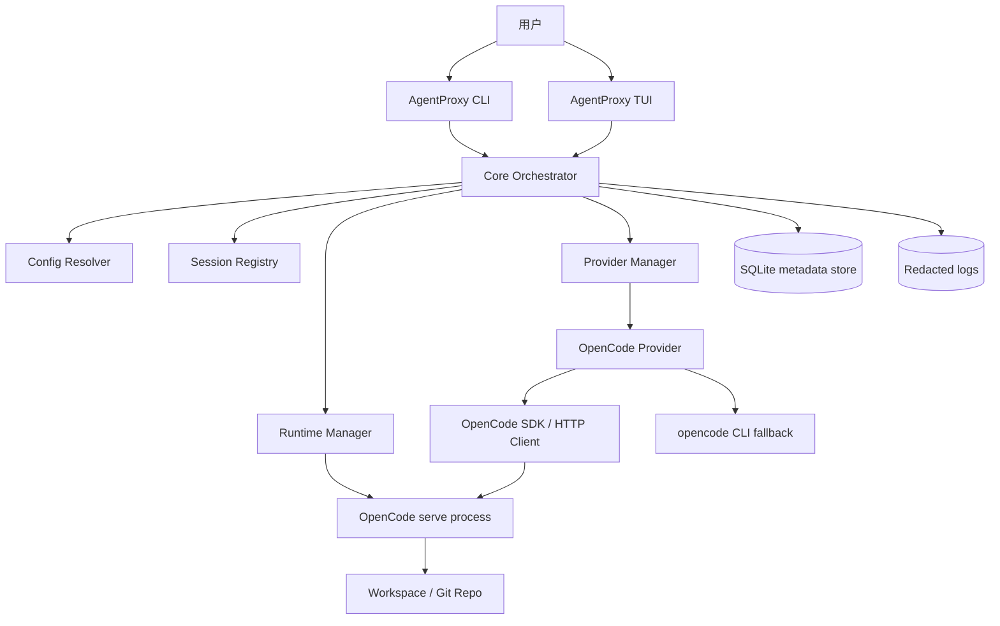
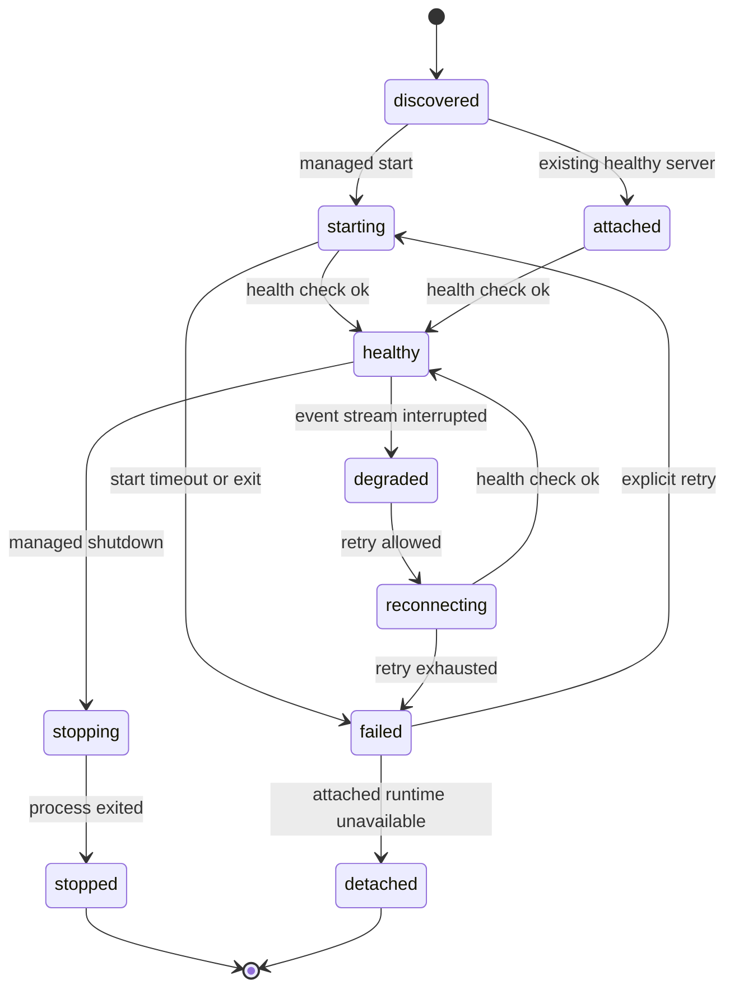
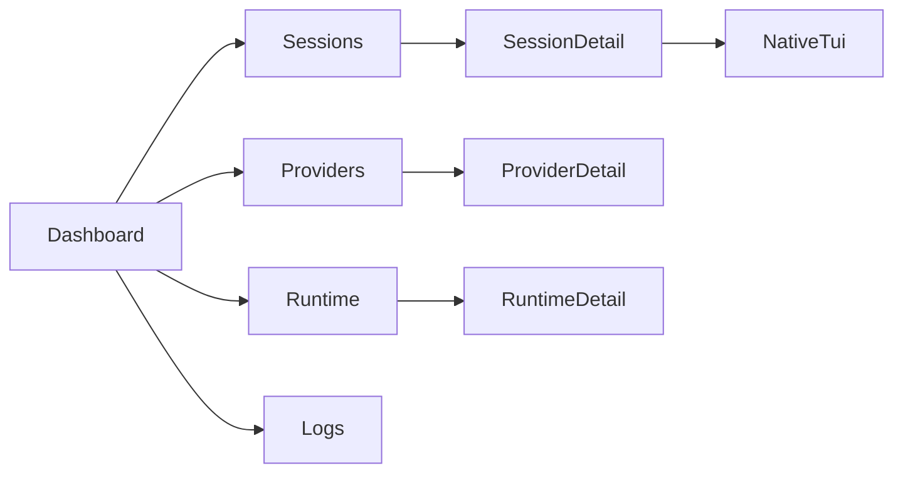
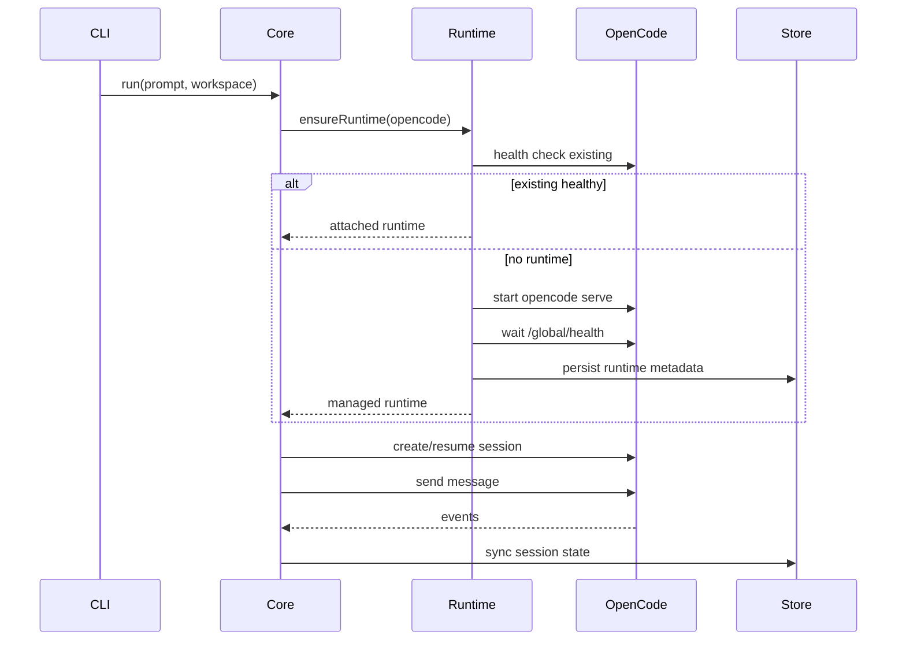

# AgentProxy 开发方案（v1：OpenCode 代理层）

- 文档状态：Draft v3
- 最后验证日期：2026-05-19
- 首版 provider：OpenCode
- 用户入口：CLI / TUI
- 核心定位：AgentProxy 是 Coding Agent runtime 的代理层和控制面，不重新实现 Agent 能力

## 1. 执行摘要

AgentProxy 的核心目标是提供一个统一的本地入口，代理不同 Coding Agent 产品的运行时能力。
v1 只接入 OpenCode，但架构必须从第一天开始为多 provider 预留边界。

最重要的架构判断是：

1. AgentProxy 不直接调用模型 API。
2. AgentProxy 不重写工具调用、MCP、权限审批、上下文压缩、文件编辑、diff、undo/redo 等 agent runtime 能力。
3. OpenCodeProvider 必须连接或启动完整的 OpenCode runtime，而不是复制 OpenCode 内部逻辑。
4. AgentProxy 负责 provider 选择、会话索引、命令路由、runtime 生命周期、状态展示、日志与错误归一化。
5. 对 OpenCode 已支持但 AgentProxy 尚未抽象的能力，必须保留 passthrough 入口，避免新能力被代理层挡住。
6. 所有核心行为都应有明确契约，包括状态机、输出格式、错误码、数据 source of truth 和兼容性验证。

简化成一句话：**AgentProxy 是 control plane，OpenCode 是 v1 data plane。**

## 2. 需求理解

### 2.1 用户意图

用户希望 AgentProxy 成为各类 Coding Agent 产品的代理层。它不是一个新 Agent，也不是统一大模型调用框架，而是一个统一入口，用于复用已有成熟 Coding Agent 的能力。

首个版本应直接复用 OpenCode，未来再接入 Claude Code、Codex 等 provider。

### 2.2 产品形态

v1 的产品形态应包含两类入口：

- CLI：适合脚本化、快速执行、CI、本地自动化。
- TUI：适合交互式选择 workspace、provider、session、模型和运行状态。

TUI 不应该重做 OpenCode 的完整交互体验。更合理的定位是：

- 管理入口
- 会话选择器
- provider 状态面板
- native TUI 启动器
- 运行中任务观察器

### 2.3 成功标准

AgentProxy v1 成功的标志不是“功能比 OpenCode 多”，而是：

- 用户可以用一个稳定入口管理 OpenCode 会话。
- AgentProxy 不阻挡 OpenCode 新增能力。
- OpenCode 升级后，AgentProxy 只需极少或无需改动即可受益。
- 后续新增 provider 时，不需要推翻 v1 架构。

## 3. 调研结论

### 3.1 OpenCode 架构适配性

OpenCode 官方文档显示，它天然适合作为 AgentProxy 的第一个 provider：

- `opencode serve` 可以启动 headless HTTP server。
- server 暴露 OpenAPI 3.1 规格和 SSE 事件流。
- OpenCode TUI 本身就是连接 server 的客户端。
- server 提供 session、message、provider、config、TUI control、MCP、LSP、file、auth 等 API。
- JS/TS SDK 是围绕 server API 生成或封装的 type-safe client。
- CLI 提供 `run`、`serve`、`session`、`export`、`import`、`stats`、`upgrade`、`acp` 等命令。

这说明 AgentProxy 不需要解析终端 UI，也不需要猜测 OpenCode 内部状态。
正确路径是把 OpenCode runtime 当作正式进程和 API 边界使用。

### 3.2 关键能力映射

| OpenCode 能力 | AgentProxy v1 使用方式 | 备注 |
| --- | --- | --- |
| `opencode serve` | 首选 runtime 启动方式 | 结构化 API、SSE、OpenAPI |
| `@opencode-ai/sdk` | 首选编程接入方式 | TypeScript 项目优先使用 |
| `opencode run` | 非交互兜底或简单执行 | 可作为 CLI fallback |
| `opencode session` | session fallback / passthrough | 优先 server API |
| `opencode export/import` | 导入导出能力 | 注意 sanitize |
| `/tui` server API | native TUI 控制 | 可做 prompt 预填、打开 session selector |
| MCP config/API | 只观察和透传 | 不重写 MCP 协议 |
| permissions | 继承 OpenCode | AgentProxy 不默认跳过权限 |
| snapshots / undo | 继承 OpenCode | 不维护第二套文件回滚系统 |
| ACP | 后续 provider 标准化候选 | v1 仅调研，不作为主路径 |

### 3.3 设计推论

- AgentProxy 的 provider 接口要围绕 capability，而不是围绕 OpenCode 的当前命令名。
- OpenCode 的 API 很丰富，但 AgentProxy v1 只抽最小公共面。
- 对 provider 原生能力应支持 passthrough，避免抽象层滞后。
- 对 session、diff、permission 等高价值状态应尽量使用结构化 API，而不是解析 stdout。

## 4. 目标与非目标

### 4.1 v1 目标

- 提供统一 `agentproxy` CLI。
- 提供轻量 `agentproxy chat` TUI。
- 首个 provider 实现 `OpenCodeProvider`。
- 支持 runtime health check。
- 支持启动、连接、停止 OpenCode server。
- 支持创建、运行、恢复、列出、删除、导出、分享 session。
- 支持 provider passthrough。
- 支持本地 session registry。
- 支持基础日志、错误码和诊断。
- 支持最小配置文件。
- 建立测试矩阵，覆盖 provider contract 和 OpenCode integration。

### 4.2 v1 非目标

- 不实现自己的 Agent planner。
- 不实现自己的 MCP server/client。
- 不实现自己的工具执行沙箱。
- 不实现自己的模型 provider 层。
- 不维护 OpenCode transcript 的完整副本。
- 不实现云端账号、团队空间或远程控制台。
- 不把 Claude Code、Codex 纳入 v1 scope。

### 4.3 未来目标

- Claude Code provider。
- Codex provider。
- ACP 适配层。
- 多 provider session 统一检索。
- 多 workspace dashboard。
- provider benchmark / comparison。
- policy layer，用于跨 provider 约束危险操作。

## 5. 核心设计原则

### 5.1 薄代理

AgentProxy 的代理层越薄，越能自动受益于 provider 升级。

工程约束：

- 不复制 provider 内部状态机。
- 不模拟 provider 的工具执行。
- 不把 provider 私有字段提升为全局强约束。
- 所有可透传能力保留原生 escape hatch。

### 5.2 能力协商

多 provider 的正确抽象不是假设大家都一样，而是先声明 capability。

例如：

- OpenCode 支持 HTTP server 和 SSE。
- 某些 provider 可能只有 CLI。
- 某些 provider 支持 session fork，某些不支持。
- 某些 provider 支持 export/share，某些不支持。

CLI/TUI 必须根据 capability 控制功能显示，而不是硬编码 provider 名称。

### 5.3 Runtime 优先

OpenCode 的每次升级应由 OpenCode runtime 自己吸收。AgentProxy 只负责连接 runtime。

因此 v1 应优先使用：

1. SDK client
2. OpenAPI HTTP client
3. CLI 命令 fallback
4. stdout 解析仅作为最后兜底

### 5.4 本地优先

AgentProxy 默认只在本机运行。

- 不强制联网。
- 不上传 session。
- 不收集 telemetry。
- 不复制 secret。
- 不接管 provider credential store。

### 5.5 可验证

每个关键行为必须能通过测试或 `doctor` 证明：

- provider binary 是否存在
- runtime 是否能启动
- API 是否可连通
- session 是否可创建
- event stream 是否可读
- export/import 是否可用

## 6. 总体架构



### 6.1 模块职责

| 模块 | 职责 | 不负责 |
| --- | --- | --- |
| CLI | 命令解析、输出、退出码 | provider 内部状态 |
| TUI | 会话选择、状态展示、native TUI 启动 | 聊天引擎 |
| Core | 命令编排、错误归一化、配置合并 | 模型推理 |
| Runtime Manager | 启停 server、端口管理、进程回收 | 执行 agent 工具 |
| Provider Manager | provider 注册、能力探测、路由 | provider 业务逻辑 |
| OpenCodeProvider | OpenCode API/CLI 适配 | 抽象其他 provider |
| Session Registry | 本地索引、跨 provider 查询 | 完整 transcript |
| Config Resolver | AgentProxy 配置解析 | 改写 OpenCode 配置语义 |
| Logger | 脱敏日志、诊断上下文 | 记录 secret |

### 6.2 推荐目录结构

```text
AgentProxy/
  docs/
    agentproxy-development-plan.md
  tasks/
    todo.md
    lessons.md
  src/
    cli/
      index.ts
      commands/
    tui/
      app.tsx
      components/
    core/
      orchestrator.ts
      errors.ts
      events.ts
    config/
      resolver.ts
      schema.ts
    providers/
      types.ts
      registry.ts
      opencode/
        provider.ts
        runtime.ts
        mapper.ts
    sessions/
      registry.ts
      store.ts
    storage/
      sqlite.ts
      migrations/
    logging/
      logger.ts
      redact.ts
    tests/
      fixtures/
      mocks/
```

### 6.3 进程模型

v1 推荐支持三种 OpenCode runtime 模式：

| 模式 | 场景 | AgentProxy 行为 |
| --- | --- | --- |
| managed | 用户未启动 OpenCode | AgentProxy 启动 `opencode serve` 并托管生命周期 |
| attached | 用户已有 OpenCode server | AgentProxy 连接现有 server，不负责关闭 |
| passthrough | 用户要执行原生命令 | AgentProxy 只定位 provider 并转发命令 |

默认优先级：

1. 用户显式 `--server-url`：attached。
2. AgentProxy registry 中存在可用 server：attached。
3. 启动 managed server。
4. 如果 server 不可用但命令可 fallback：使用 CLI fallback。

### 6.4 Runtime 状态机

Runtime 管理是 AgentProxy v1 最容易出现不一致的地方，必须先定义状态机。



状态定义：

| 状态 | 含义 | 可执行动作 |
| --- | --- | --- |
| `discovered` | 找到配置或历史 runtime，但尚未确认健康 | health check、attach、start |
| `starting` | AgentProxy 正在启动 managed runtime | wait health、cancel |
| `attached` | 连接到外部 runtime | health check、disconnect |
| `healthy` | API 可达且 provider health 通过 | run、resume、stream、stop |
| `degraded` | 主 API 可达但事件流或部分能力异常 | reconnect、fallback、doctor |
| `reconnecting` | 事件流或 server 连接重试中 | wait、abort |
| `failed` | runtime 不可用 | retry、doctor |
| `stopping` | managed runtime 正在关闭 | wait |
| `stopped` | managed runtime 已停止 | cleanup、start |
| `detached` | attached runtime 已断开 | forget、attach |

迁移规则：

- `managed` runtime 只有 AgentProxy 启动的进程才允许进入 `stopping`。
- `attached` runtime 不允许由 AgentProxy kill，只能进入 `detached`。
- 事件流断开不等于 session 失败，先进入 `degraded` 并尝试状态补偿。
- health check 连续失败超过阈值后进入 `failed`。
- 下次启动时若 registry 中存在 `pid`，必须先检查 PID 是否仍是 OpenCode 进程，再决定 attach 或 cleanup。

清理策略：

- registry 中的 stopped runtime 可保留最近 20 条用于诊断。
- orphan managed process 只在能确认命令、PID、启动时间都匹配时清理。
- 端口被非 OpenCode 进程占用时不得强杀，改用随机空闲端口并给出 warning。

## 7. Provider 抽象设计

### 7.1 Provider 接口草案

```ts
export interface AgentProvider {
  readonly id: string;
  readonly displayName: string;

  getCapabilities(ctx: ProviderContext): Promise<ProviderCapabilities>;
  healthCheck(ctx: ProviderContext): Promise<ProviderHealth>;

  ensureRuntime(ctx: RuntimeRequest): Promise<RuntimeHandle>;
  shutdownRuntime(handle: RuntimeHandle): Promise<void>;

  listModels(ctx: ProviderContext): Promise<ModelRef[]>;
  listSessions(ctx: ProviderContext, query?: SessionQuery): Promise<ProviderSession[]>;
  getSession(ctx: ProviderContext, id: string): Promise<ProviderSession>;

  startSession(ctx: StartSessionRequest): Promise<ProviderSession>;
  resumeSession(ctx: ResumeSessionRequest): Promise<ProviderSession>;
  sendMessage(ctx: SendMessageRequest): AsyncIterable<AgentEvent>;

  abortSession(ctx: SessionActionRequest): Promise<void>;
  deleteSession(ctx: SessionActionRequest): Promise<void>;
  exportSession(ctx: ExportSessionRequest): Promise<ExportResult>;
  importSession(ctx: ImportSessionRequest): Promise<ProviderSession>;
  shareSession(ctx: SessionActionRequest): Promise<ShareResult>;

  openNativeTui(ctx: NativeTuiRequest): Promise<NativeTuiResult>;
  passthrough(ctx: PassthroughRequest): Promise<PassthroughResult>;
}
```

### 7.2 Capability 模型

```ts
export interface ProviderCapabilities {
  schemaVersion: string;
  providerVersion?: string;
  runtime: {
    serve: boolean;
    attach: boolean;
    managedLifecycle: boolean;
    sse: boolean;
    openApi: boolean;
    sdk: boolean;
  };
  sessions: {
    list: boolean;
    create: boolean;
    resume: boolean;
    fork: boolean;
    delete: boolean;
    export: boolean;
    import: boolean;
    share: boolean;
    diff: boolean;
    revert: boolean;
    todo: boolean;
  };
  interaction: {
    nativeTui: boolean;
    headlessRun: boolean;
    promptPrefill: boolean;
    slashCommands: boolean;
    permissions: boolean;
  };
  ecosystem: {
    mcp: boolean;
    lsp: boolean;
    formatters: boolean;
    customAgents: boolean;
    customCommands: boolean;
    plugins: boolean;
  };
}
```

### 7.3 OpenCodeProvider 初始能力

基于当前 OpenCode 文档，OpenCodeProvider v1 可声明：

- runtime：`serve`、`attach`、`managedLifecycle`、`sse`、`openApi`、`sdk`
- sessions：`list`、`create`、`resume`、`fork`、`delete`、`export`、`import`、`share`、`diff`、`revert`、`todo`
- interaction：`nativeTui`、`headlessRun`、`promptPrefill`、`slashCommands`、`permissions`
- ecosystem：`mcp`、`lsp`、`formatters`、`customAgents`、`customCommands`、`plugins`

实现时不要把这些常量写死为永久事实。`doctor` 和 integration tests 应验证当前 runtime 是否真的支持。

### 7.5 Capability 版本化与协商

Capability 模型本身必须版本化，否则后续 provider 接入时容易发生“字段存在但语义不同”的问题。

规则：

- `schemaVersion` 用于区分 capability 结构版本。
- `providerVersion` 用于记录运行时版本，不等同于 capability 版本。
- 当 capability schema 发生不兼容变化时，必须提升 `schemaVersion`。
- CLI/TUI 读取 capability 时必须先检查 schemaVersion。
- 新能力字段默认应视为 `false`，而不是推断为 true。
- provider 若返回未知字段，AgentProxy 应保留在 `metadata` 中，不丢弃。

协商流程：

1. provider 注册后先拉取 capabilities。
2. 若 `schemaVersion` 不兼容，直接降级为 limited mode。
3. limited mode 只暴露 health、doctor、passthrough 和最基础 session list。
4. 若 capability 与 runtime probe 冲突，以 runtime probe 为准。

### 7.4 Provider 适配规则

- provider 返回原始 ID 时，AgentProxy 保存 `providerSessionId`，不重写 ID。
- AgentProxy 自己生成 `agentproxySessionId`，用于跨 provider 索引。
- provider error 必须保留 `providerId`、`operation`、`rawCode`、`rawMessage`。
- provider-specific 字段进入 `metadata`，不要提升成通用字段。
- provider 不支持的操作返回 `CapabilityUnsupportedError`，不要模拟成功。

## 8. OpenCode 接入方案

### 8.1 首选路径：SDK + managed/attached server

推荐使用 `@opencode-ai/sdk`：

- managed 模式：`createOpencode()` 启动 server 和 client。
- attached 模式：`createOpencodeClient({ baseUrl })` 连接已有 server。

AgentProxy 应封装成 `OpenCodeRuntime`：

```ts
export interface OpenCodeRuntime {
  mode: "managed" | "attached";
  baseUrl: string;
  version?: string;
  pid?: number;
  startedAt: Date;
  close(): Promise<void>;
}
```

### 8.2 Server API 使用优先级

OpenCodeProvider 应优先调用这些 API：

| AgentProxy 操作 | OpenCode API |
| --- | --- |
| health | `GET /global/health` |
| events | `GET /event` 或 `GET /global/event` |
| list sessions | `GET /session` |
| create session | `POST /session` |
| session status | `GET /session/status` |
| get messages | `GET /session/:id/message` |
| send message | `POST /session/:id/message` 或 async prompt API |
| abort | `POST /session/:id/abort` |
| share/unshare | `POST/DELETE /session/:id/share` |
| diff | `GET /session/:id/diff` |
| permission response | `POST /session/:id/permissions/:permissionID` |
| provider list | `GET /provider` |
| config | `GET/PATCH /config` |
| MCP status | `GET /mcp` |
| TUI prefill | `POST /tui/append-prompt` |
| TUI submit | `POST /tui/submit-prompt` |

### 8.3 CLI fallback

CLI fallback 只用于：

- SDK 不可用。
- server API 不覆盖某个稳定命令。
- 用户显式 passthrough。
- 诊断 runtime 安装状态。

fallback 命令示例：

```bash
opencode --version
opencode serve --hostname 127.0.0.1 --port 4096
opencode run "..."
opencode session list --format json
opencode export <sessionID> --sanitize
opencode import <file>
```

### 8.4 不推荐路径

以下做法应避免：

- 解析 TUI 屏幕输出。
- 依赖日志文本推断状态。
- 自动修改用户 OpenCode 全局配置。
- 默认启用 `--dangerously-skip-permissions`。
- 在 AgentProxy 中复制 MCP server 配置并二次执行。

## 9. CLI 设计

### 9.1 命令矩阵

```text
agentproxy doctor
agentproxy run [prompt] [--provider opencode] [--workspace .] [--model provider/model]
agentproxy chat [--provider opencode] [--workspace .] [--session <id>]
agentproxy sessions list [--provider opencode] [--workspace .] [--json]
agentproxy sessions show <id> [--json]
agentproxy sessions resume <id> [--prompt "..."]
agentproxy sessions abort <id>
agentproxy sessions delete <id>
agentproxy sessions export <id> [--sanitize] [--output file.json]
agentproxy sessions import <file-or-url>
agentproxy sessions share <id>
agentproxy sessions unshare <id>
agentproxy providers list [--json]
agentproxy providers inspect <id> [--json]
agentproxy provider exec <id> -- <native args>
agentproxy config get [key]
agentproxy config set <key> <value>
agentproxy runtime list
agentproxy runtime stop <runtime-id>
```

### 9.2 CLI 输出规范

默认输出面向人类，`--json` 输出面向脚本。

原则：

- 成功输出简洁。
- 长任务显示阶段和 session id。
- 错误输出包含建议动作。
- `--json` 不夹杂 spinner 或颜色控制码。
- 退出码稳定。

### 9.3 退出码

| Code | 含义 |
| --- | --- |
| 0 | 成功 |
| 1 | 通用失败 |
| 2 | 参数错误 |
| 3 | 配置错误 |
| 4 | provider 不可用 |
| 5 | runtime 启动失败 |
| 6 | provider capability 不支持 |
| 7 | 用户取消或 abort |
| 8 | 权限被拒绝 |
| 9 | 网络或 server 连接失败 |
| 10 | 数据存储错误 |

### 9.4 示例体验

```bash
agentproxy doctor
agentproxy run "scan this repo and summarize the architecture"
agentproxy sessions list --json
agentproxy sessions resume apx_01HX... --prompt "continue and add tests"
agentproxy provider exec opencode -- mcp list
```

### 9.5 命令契约

全局参数：

| 参数 | 作用 | 默认值 |
| --- | --- | --- |
| `--provider` | 指定 provider | `opencode` |
| `--workspace` | 指定 workspace | 当前目录 |
| `--json` | 机器可读输出 | false |
| `--verbose` | 增加调试信息 | false |
| `--debug` | 输出诊断上下文 | false |
| `--config` | 指定 AgentProxy 配置 | 自动发现 |

输出分工：

- `stdout`：正常结果、JSON、最终状态。
- `stderr`：进度、warning、诊断、错误摘要。
- `--json` 模式下，`stderr` 只保留必要 warning，不打印 spinner。

行为约束：

- `run` 必须返回稳定 session id。
- `resume` 必须保留原 session 的 provider id。
- `sessions list` 的排序默认按最近更新时间降序。
- `providers list` 只展示已注册且可探测的 provider。
- `provider exec` 的第一个非 flag 参数必须是 provider 名称。
- destructive 命令默认要求交互确认，除非传 `--yes`。

## 10. TUI 设计

### 10.1 TUI 定位

AgentProxy TUI 是 provider 控制面，不是 OpenCode TUI 的替代品。

首屏建议包含：

- 当前 workspace
- 当前 provider
- provider health
- runtime 状态
- 最近 sessions
- 快捷操作：run、resume、open native TUI、doctor

### 10.2 TUI 页面

| 页面 | 功能 |
| --- | --- |
| Dashboard | 总览 provider/runtime/session |
| Sessions | 列表、过滤、恢复、导出、分享 |
| Providers | 能力、版本、认证状态、模型 |
| Runtime | server URL、PID、端口、启动/停止 |
| Logs | 脱敏日志和错误详情 |
| Settings | AgentProxy 配置，不编辑 provider secret |

### 10.3 Native TUI 集成

OpenCodeProvider 可提供：

- 启动 `opencode <workspace>`。
- 使用 server `/tui` API 预填 prompt。
- 打开 OpenCode session selector。
- 打开 model selector。

AgentProxy TUI 需要清楚区分：

- AgentProxy UI：管理层。
- OpenCode UI：原生执行层。

### 10.4 TUI 交互契约

基础按键：

| 按键 | 行为 |
| --- | --- |
| `q` | 返回上一层或退出 |
| `?` | 打开帮助 |
| `/` | 搜索当前列表 |
| `r` | 刷新当前页面 |
| `d` | 运行 doctor |
| `n` | 新建 run |
| `Enter` | 打开当前选中项 |
| `Esc` | 关闭弹层或取消输入 |

页面流转：



约束：

- TUI 页面必须能在 provider limited mode 下显示降级原因。
- TUI 不保存完整 prompt history。
- TUI 中的危险操作必须二次确认。
- 打开 native TUI 前必须明确目标 workspace 和 session。
- TUI 不应隐藏 provider 原生错误，只能补充解释和下一步建议。

## 11. 会话模型

### 11.1 双 ID 设计

AgentProxy 必须区分两类 ID：

- `agentproxySessionId`：AgentProxy 本地统一 ID。
- `providerSessionId`：provider 原始 session ID。

原因：

- 未来多个 provider 的 session ID 格式不同。
- provider session 可能导入、删除或 fork。
- AgentProxy 需要独立维护 workspace 和 runtime 索引。

### 11.2 Session 元数据

```ts
export interface AgentProxySession {
  id: string;
  providerId: string;
  providerSessionId: string;
  workspacePath: string;
  title?: string;
  status: "idle" | "running" | "waiting" | "failed" | "completed" | "unknown";
  createdAt: string;
  updatedAt: string;
  lastRunAt?: string;
  model?: string;
  runtimeId?: string;
  parentSessionId?: string;
  tags: string[];
  metadata: Record<string, unknown>;
}
```

### 11.3 Session 状态同步

同步策略：

1. CLI/TUI 启动时同步最近 sessions。
2. `run/resume/abort/delete/export/share` 后立即同步对应 session。
3. 运行中通过 SSE 更新状态。
4. provider 不可用时保留本地 stale 状态，并标记 `lastSyncFailedAt`。

### 11.4 不复制 transcript

AgentProxy 不默认保存完整消息内容。

允许保存：

- 标题
- 最近摘要
- provider session id
- workspace
- 状态
- 创建/更新时间
- 最后错误摘要

完整消息查看应实时从 provider 拉取，或通过 provider export 获取。

### 11.5 Source of truth 与冲突处理

Provider 是 session 内容的 source of truth，AgentProxy 是 session 索引的 source of truth。

具体规则：

| 数据 | Source of truth | AgentProxy 行为 |
| --- | --- | --- |
| 完整消息 | provider | 按需读取，不默认复制 |
| tool 调用详情 | provider | 只保存摘要或事件类型 |
| session 标题 | provider 优先 | 本地可缓存，provider 更新后覆盖 |
| workspace path | AgentProxy | 创建/导入时记录 |
| providerSessionId | provider | 不重写 |
| agentproxySessionId | AgentProxy | 本地生成 |
| 删除状态 | 两边共同判断 | 使用 tombstone 避免误恢复 |

冲突处理：

- provider session 存在、本地不存在：导入为新本地索引。
- 本地存在、provider 不存在：标记 `missing_in_provider`，不立即删除。
- provider 标题或状态变化：provider 覆盖本地缓存。
- workspace path 冲突：保留本地原始 workspace，同时在 metadata 记录 provider 返回值。
- 用户显式删除本地索引时，不默认删除 provider session，除非命令明确为 provider delete。

删除策略：

- `sessions delete` 默认删除 provider session，并写本地 tombstone。
- `sessions forget` 可作为未来命令，仅删除本地索引。
- tombstone 至少保留 30 天，防止下一次同步误导入。
- export/import 生成的新 session 必须记录 parent 或 origin metadata。

## 12. 事件模型

### 12.1 统一事件

```ts
export type AgentEvent =
  | SessionStartedEvent
  | SessionStatusChangedEvent
  | MessageDeltaEvent
  | ToolStartedEvent
  | ToolFinishedEvent
  | PermissionRequestedEvent
  | PermissionResolvedEvent
  | FileChangedEvent
  | DiffUpdatedEvent
  | ErrorEvent
  | SessionCompletedEvent;
```

### 12.2 Event envelope

```ts
export interface AgentEventEnvelope<T = unknown> {
  id: string;
  providerId: string;
  providerSessionId?: string;
  agentproxySessionId?: string;
  type: string;
  timestamp: string;
  payload: T;
  raw?: unknown;
}
```

### 12.3 映射原则

- 保留 `raw` 仅用于调试，不作为业务逻辑依赖。
- 事件类型要少，payload 要稳定。
- provider 新事件无法识别时映射为 `provider.raw_event`，不丢弃。
- event stream 断开后允许重连，并用 session 状态 API 补齐。

## 13. 数据存储设计

### 13.1 SQLite schema 草案

```sql
CREATE TABLE providers (
  id TEXT PRIMARY KEY,
  display_name TEXT NOT NULL,
  enabled INTEGER NOT NULL DEFAULT 1,
  last_seen_version TEXT,
  last_health_status TEXT,
  last_health_checked_at TEXT,
  metadata_json TEXT NOT NULL DEFAULT '{}'
);

CREATE TABLE runtimes (
  id TEXT PRIMARY KEY,
  provider_id TEXT NOT NULL,
  mode TEXT NOT NULL,
  base_url TEXT,
  hostname TEXT,
  port INTEGER,
  pid INTEGER,
  workspace_path TEXT,
  status TEXT NOT NULL,
  started_at TEXT NOT NULL,
  stopped_at TEXT,
  metadata_json TEXT NOT NULL DEFAULT '{}'
);

CREATE TABLE sessions (
  id TEXT PRIMARY KEY,
  provider_id TEXT NOT NULL,
  provider_session_id TEXT NOT NULL,
  workspace_path TEXT NOT NULL,
  title TEXT,
  status TEXT NOT NULL,
  model TEXT,
  runtime_id TEXT,
  parent_session_id TEXT,
  created_at TEXT NOT NULL,
  updated_at TEXT NOT NULL,
  last_run_at TEXT,
  last_sync_at TEXT,
  last_error TEXT,
  deleted_at TEXT,
  tombstone_reason TEXT,
  source_of_truth TEXT NOT NULL DEFAULT 'provider_content_agentproxy_index',
  metadata_json TEXT NOT NULL DEFAULT '{}',
  UNIQUE(provider_id, provider_session_id)
);

CREATE TABLE session_events (
  id TEXT PRIMARY KEY,
  session_id TEXT NOT NULL,
  provider_id TEXT NOT NULL,
  event_type TEXT NOT NULL,
  created_at TEXT NOT NULL,
  payload_json TEXT NOT NULL
);
```

### 13.2 存储边界

默认保存：

- provider metadata
- runtime metadata
- session index
- 脱敏事件摘要
- last error

默认不保存：

- 完整 prompt
- 完整 response
- secret
- OAuth token
- provider credential file
- 大型 tool output

### 13.3 迁移策略

- 使用显式 migration 文件。
- 每次启动检查 schema version。
- migration 必须可重复验证。
- 破坏性迁移必须先备份 SQLite 文件。
- v1 期间避免引入复杂 ORM，可用轻量 query builder 或直接 SQL。

## 14. 配置设计

### 14.1 AgentProxy 配置文件

建议路径：

- 全局：`~/.config/agentproxy/config.json`
- 项目：`.agentproxy/config.json`

示例：

```json
{
  "$schema": "https://agentproxy.local/config.schema.json",
  "defaultProvider": "opencode",
  "storage": {
    "path": "~/.local/share/agentproxy/agentproxy.sqlite"
  },
  "providers": {
    "opencode": {
      "enabled": true,
      "binary": "opencode",
      "runtime": {
        "mode": "managed",
        "hostname": "127.0.0.1",
        "port": 4096
      }
    }
  },
  "logging": {
    "level": "info",
    "redact": true
  }
}
```

### 14.2 配置合并顺序

AgentProxy 自己的配置建议：

1. 内置默认值
2. 全局配置
3. 项目配置
4. 环境变量
5. CLI flags

OpenCode 的配置仍由 OpenCode 自己处理。AgentProxy 只允许显式透传：

- `OPENCODE_CONFIG`
- `OPENCODE_CONFIG_CONTENT`
- `OPENCODE_TUI_CONFIG`
- `OPENCODE_SERVER_PASSWORD`
- `OPENCODE_SERVER_USERNAME`

### 14.3 配置边界

AgentProxy 可以读取 OpenCode health/config/status 来展示状态，但不应默认写 OpenCode 配置。

允许写入的场景：

- 用户明确运行 `agentproxy provider exec opencode -- ...`
- 用户明确执行某个 OpenCode config mutation 命令
- 未来提供交互式确认

## 15. Runtime 生命周期

### 15.1 启动流程



### 15.2 关闭策略

- managed runtime：AgentProxy 可以关闭。
- attached runtime：AgentProxy 不关闭，只断开连接。
- crash：记录 runtime 状态并提示 `doctor`。
- orphan process：下次启动通过 PID + health check 清理状态。

### 15.3 端口策略

默认使用 `127.0.0.1:4096`，但必须处理端口占用：

1. 如果端口已有 OpenCode server 且 health 通过，attach。
2. 如果端口被非 OpenCode 进程占用，选择空闲端口。
3. 保存 runtime URL 到 registry。
4. 禁止默认监听 `0.0.0.0`。

## 16. 安全设计

### 16.1 Secret 处理

- 不复制 OpenCode 凭据。
- 不记录 API key、OAuth token、HTTP basic auth password。
- 日志 redaction 覆盖常见 key：`token`、`secret`、`password`、`api_key`、`authorization`。
- crash dump 不包含 env 全量快照。

### 16.2 权限模型

AgentProxy 继承 provider 的权限机制。

默认行为：

- 不自动 approve permission request。
- 不默认传递危险跳过权限的 flag。
- TUI 只展示权限请求并把用户选择传回 provider。

### 16.3 Server 暴露面

- 默认绑定 `127.0.0.1`。
- attached 到非 localhost server 时显示警告。
- 支持 Basic Auth 配置，但不在日志打印密码。
- CORS 默认不扩展，除非用户明确配置。

### 16.4 Passthrough 风险

`provider exec` 是 escape hatch，风险更高。

要求：

- 清楚显示将执行的 provider 和 args。
- 保留 provider 原始退出码。
- 不二次解释危险命令。
- 可选加入 `--confirm` 机制用于 destructive 命令。

### 16.5 Workspace trust

AgentProxy 会在用户 workspace 内启动 provider runtime，因此需要明确 workspace 信任模型。

规则：

- 首次进入新 workspace 时记录 trust 状态。
- 未 trusted 的 workspace 只允许 `doctor`、`sessions list`、`provider inspect` 等只读操作。
- 运行 `run/resume/provider exec` 前必须确认 trust。
- trust 记录保存 workspace 真实路径和 Git root，避免软链接混淆。
- trust 状态不替代 provider 自己的权限审批。

### 16.6 环境变量白名单

子进程环境变量应采用 allowlist 加 redaction。

默认允许：

- `PATH`
- `HOME`
- `SHELL`
- `TERM`
- `LANG`
- `LC_*`
- 明确配置的 `OPENCODE_*`

默认不记录：

- `*_KEY`
- `*_TOKEN`
- `*_SECRET`
- `*_PASSWORD`
- `AUTHORIZATION`

如果用户需要额外环境变量，应通过 AgentProxy 配置显式声明。

### 16.7 Export sanitize

导出 session 时默认建议启用 sanitize。

策略：

- `sessions export` 默认提示是否 sanitize。
- `sessions export --sanitize` 强制脱敏。
- `sessions export --raw` 必须二次确认。
- JSON 输出中必须标记 `sanitized: true | false`。
- debug bundle 永远不包含 raw export。

## 17. 错误处理与诊断

### 17.1 错误类型

```ts
export type AgentProxyErrorCode =
  | "CONFIG_INVALID"
  | "PROVIDER_NOT_FOUND"
  | "PROVIDER_UNAVAILABLE"
  | "CAPABILITY_UNSUPPORTED"
  | "RUNTIME_START_FAILED"
  | "RUNTIME_HEALTH_FAILED"
  | "SESSION_NOT_FOUND"
  | "PERMISSION_DENIED"
  | "EVENT_STREAM_INTERRUPTED"
  | "STORAGE_ERROR"
  | "PASSTHROUGH_FAILED";
```

### 17.2 `doctor` 检查项

`agentproxy doctor` 应检查：

- Node.js 版本。
- AgentProxy config 是否可解析。
- SQLite 文件是否可读写。
- `opencode` binary 是否存在。
- OpenCode version。
- 能否启动或连接 server。
- `GET /global/health` 是否成功。
- provider 列表是否可读。
- MCP status 是否可读。
- 当前 workspace 是否为 Git repo。
- OpenCode config 是否存在明显冲突。

### 17.3 错误输出格式

人类输出：

```text
Provider unavailable: opencode
Cause: failed to connect to http://127.0.0.1:4096
Next: run `agentproxy doctor` or check `opencode serve`
```

JSON 输出：

```json
{
  "ok": false,
  "error": {
    "code": "PROVIDER_UNAVAILABLE",
    "providerId": "opencode",
    "operation": "healthCheck",
    "message": "failed to connect to runtime",
    "next": "run agentproxy doctor"
  }
}
```

### 17.4 可观测性与 debug bundle

AgentProxy 需要能定位 provider runtime 问题，但不能泄漏敏感数据。

日志字段：

| 字段 | 说明 |
| --- | --- |
| `correlationId` | 一次 CLI/TUI 操作的关联 ID |
| `sessionId` | AgentProxy session id |
| `providerId` | provider 名称 |
| `providerSessionId` | provider 原始 session id |
| `runtimeId` | runtime registry id |
| `operation` | 当前操作 |
| `durationMs` | 耗时 |
| `result` | success / failure / cancelled |

debug bundle 内容：

- AgentProxy version。
- Node.js version。
- OS 和 CPU 架构。
- provider 列表和 capability 摘要。
- OpenCode version。
- runtime registry 摘要。
- 最近错误栈，已脱敏。
- config 摘要，已移除 secret。

debug bundle 不包含：

- 完整 prompt。
- 完整 transcript。
- raw export。
- provider credential。
- 全量环境变量。

建议命令：

```bash
agentproxy doctor --json
agentproxy debug bundle --output agentproxy-debug.zip
```

## 18. 测试策略

### 18.1 测试分层

| 层级 | 目标 | 示例 |
| --- | --- | --- |
| unit | 纯逻辑 | config merge、redaction、capability 判定 |
| contract | provider 接口 | mock provider 必须满足接口 |
| integration | OpenCode runtime | 启动 server、health、session list |
| e2e | 用户命令 | `agentproxy run`、`sessions resume` |
| regression | 升级兼容 | 不同 OpenCode 版本 smoke test |

### 18.2 必测用例

- `doctor` 在未安装 opencode 时给出清晰错误。
- managed runtime 可以启动并通过 health check。
- attached runtime 不会被 AgentProxy 关闭。
- `run` 创建 session 并记录本地索引。
- session list 能合并本地索引和 provider 状态。
- event stream 断开后能给出可理解错误。
- export 默认支持 sanitize。
- passthrough 保留原始退出码。
- 日志 redaction 不泄漏 secret。

### 18.3 Mock 策略

建议提供 fake `opencode` binary 和 fake OpenCode server：

- fake binary 用于 CLI fallback。
- fake server 用于 OpenAPI/SSE integration。
- tests 不依赖真实模型调用。
- 真实 OpenCode integration 标记为 optional 或 nightly。

### 18.4 验证命令

未来项目初始化后，建议标准验证命令：

```bash
pnpm lint
pnpm typecheck
pnpm test
pnpm test:integration
pnpm test:e2e
```

### 18.5 兼容性测试矩阵

AgentProxy 是代理层，兼容性测试比普通 CLI 项目更重要。

建议矩阵：

| 维度 | 覆盖 |
| --- | --- |
| Node.js | 最低支持 LTS、当前 LTS |
| OS | macOS、Linux，Windows 可后置 |
| OpenCode | 最低支持版本、最新稳定版本 |
| Runtime mode | managed、attached、passthrough |
| Output mode | human、json |
| Workspace | Git repo、非 Git 目录、大型 repo |
| Network | server 正常、server 断开、事件流断开 |

发布前 smoke test：

- `agentproxy doctor`
- `agentproxy run "hello"`
- `agentproxy sessions list --json`
- `agentproxy provider exec opencode -- --version`
- managed runtime 启停
- attached runtime 不被关闭

Nightly test：

- 拉取最新 OpenCode。
- 运行 provider contract。
- 运行 server API smoke test。
- 若 capability probe 发生变化，生成报告而不是直接失败主线。

## 19. 发布与版本策略

### 19.1 包发布

建议先以 npm 包发布：

```bash
npm install -g agentproxy
```

也可以支持：

- `pnpm dlx agentproxy`
- Homebrew tap
- standalone binary

首版推荐路径：

1. npm package 作为唯一正式发布渠道。
2. standalone binary 作为 v1.1 之后的发布增强。
3. Homebrew 等渠道等 CLI 稳定后再补。

理由：

- TypeScript + Node.js 的发布路径最短。
- OpenCode SDK 依赖管理更自然。
- 早期可以更快迭代 provider contract。

### 19.2 OpenCode 版本策略

AgentProxy 不应强绑定单一 OpenCode 小版本。

建议：

- 声明最低支持版本；v1 当前最低支持 OpenCode `1.0.0`。
- `doctor` 输出当前 OpenCode 版本。
- integration tests 覆盖最低版本和最新版本。
- provider capability 由 runtime probe 得出。

### 19.3 升级策略

AgentProxy 不默认升级 OpenCode。

可以提供：

```bash
agentproxy provider exec opencode -- upgrade
```

或未来增加：

```bash
agentproxy providers upgrade opencode
```

但必须明确这是调用 OpenCode 原生升级逻辑。

### 19.4 回滚策略

AgentProxy 自身回滚：

- npm 发布必须保留 semver。
- migration 必须记录 schema version。
- 小版本升级不得破坏已有 SQLite。
- 若 migration 失败，恢复升级前备份并退出。

OpenCode runtime 回滚：

- AgentProxy 不替用户回滚 OpenCode。
- `doctor` 应报告当前 OpenCode version 与最低支持版本。
- 若最新 OpenCode 兼容性失败，AgentProxy 应提示使用 provider passthrough 或升级 AgentProxy。

### 19.5 兼容性声明

每个 AgentProxy release 应声明：

- 支持的 Node.js 版本。
- 测试过的 OpenCode 版本范围。
- 支持的 OS。
- SQLite schema version。
- capability schema version。

## 20. 里程碑计划

### Phase 0：方案与骨架

- 初始化 TypeScript 项目。
- 建立 CLI 框架。
- 建立测试框架。
- 建立 provider interface。
- 建立 SQLite migration 基础设施。

验收：

- `agentproxy --help` 可运行。
- `pnpm test` 可运行。
- mock provider contract test 通过。

### Phase 1：OpenCode runtime

- 实现 `OpenCodeRuntimeManager`。
- 支持 managed / attached。
- 支持 health check。
- 支持 runtime registry。

验收：

- `agentproxy doctor` 能发现 opencode。
- managed server 可启动并关闭。
- attached server 不被关闭。

### Phase 2：Session MVP

- 支持 session list/create/resume。
- 支持 send message。
- 支持 event stream。
- 支持 local session registry。

验收：

- `agentproxy run "..."` 可完成一次调用。
- 本地 SQLite 中能看到 session 索引。
- `agentproxy sessions list` 可显示历史。

### Phase 3：CLI 完整 v1

- 补齐 abort/delete/export/import/share。
- 补齐 JSON 输出。
- 补齐 exit code。
- 支持 passthrough。

验收：

- CLI 命令矩阵全部可用。
- 错误输出稳定。
- passthrough 保留原始行为。

### Phase 4：TUI MVP

- Dashboard。
- Sessions 页面。
- Providers 页面。
- Runtime 页面。
- 打开 OpenCode native TUI。

验收：

- 可以从 AgentProxy TUI 打开/恢复 session。
- 可以查看 provider health。
- 不重复实现 OpenCode chat engine。

### Phase 5：稳定化

- 安全审查。
- 文档补全。
- e2e 测试。
- release pipeline。

验收：

- 所有必测用例通过。
- 文档包含安装、配置、故障排查。
- v1 tag 可发布。

## 21. 风险与对策

| 风险 | 影响 | 对策 |
| --- | --- | --- |
| 过度抽象 | provider 新能力被挡住 | capability + passthrough |
| 依赖 OpenCode 私有细节 | 升级易坏 | 优先 SDK/OpenAPI，避免解析 TUI |
| 多 provider 语义差异 | 通用接口失真 | 最小 common surface，差异字段放 metadata |
| Runtime 进程泄漏 | 用户机器残留进程 | managed/attached 明确区分，registry 清理 |
| Secret 泄漏 | 高安全风险 | redaction、env allowlist、不复制凭据 |
| Event stream 不稳定 | UI 状态错误 | 断线重连 + session status 补偿 |
| SQLite schema 变更 | 数据丢失 | migration + backup |
| TUI 范围膨胀 | 变成第二个 OpenCode | 只做控制面和 native TUI launcher |

## 22. 架构决策记录

### ADR-001：v1 使用 TypeScript + Node.js

理由：

- OpenCode 提供 JS/TS SDK。
- CLI/TUI/HTTP/SSE/进程管理都适合 Node.js。
- TypeScript 适合定义 provider contract。

备选：

- Go：适合发布单 binary，但 SDK 和生态接入成本更高。
- Rust：性能和发布体验好，但开发速度不如 TypeScript。

### ADR-002：AgentProxy 不复制 transcript

理由：

- 降低隐私风险。
- 避免和 provider 状态不一致。
- 减少存储复杂度。

### ADR-003：TUI 是控制面

理由：

- OpenCode 已有原生 TUI。
- 重做 chat UI 会阻断 OpenCode 原生升级。
- 控制面 TUI 能更好服务多 provider。

### ADR-004：保留 passthrough

理由：

- provider 能力演进快。
- 抽象层不可能第一时间覆盖全部功能。
- passthrough 是避免架构僵化的安全出口。

### ADR-005：Provider 是内容 source of truth

理由：

- 避免 AgentProxy 与 provider transcript 分叉。
- 减少隐私和存储风险。
- 简化 future provider 接入。

AgentProxy 只维护索引、状态摘要和诊断元数据。

### ADR-006：Capability schema 必须版本化

理由：

- 多 provider 能力不一致。
- 同一 provider 不同版本能力也会变化。
- CLI/TUI 需要稳定降级逻辑。

### ADR-007：实施工具链基线

详细记录见 `docs/adr/0001-implementation-tooling.md`。

核心决策：

- 包管理器：`pnpm`。
- Node.js 最低版本：`>=22.0.0`。
- npm package name 和 CLI binary：`agentproxy`。
- CLI 框架：Commander。
- TUI 技术栈：Ink + React。
- SQLite 库：`better-sqlite3`。
- 测试框架：Vitest。
- lint/format：Biome。
- v1 发布渠道：只通过 npm 发布。

## 23. v1 验收清单

- [ ] `agentproxy doctor` 可以完成完整诊断。
- [ ] `agentproxy run` 可以创建或恢复 OpenCode session。
- [ ] `agentproxy sessions list` 可以显示本地和 provider session。
- [ ] `agentproxy sessions resume` 可以继续已有 session。
- [ ] `agentproxy sessions export --sanitize` 可用。
- [ ] `agentproxy provider exec opencode -- <args>` 可用。
- [ ] managed runtime 和 attached runtime 行为正确。
- [ ] 日志不泄漏 secret。
- [ ] TUI 可以打开 native OpenCode TUI。
- [ ] 所有 provider contract tests 通过。

## 24. 假设与待验证清单

### 24.1 已验证事实

- OpenCode 提供 CLI、TUI、server 和 SDK。
- OpenCode server 暴露结构化 API 和事件流。
- OpenCode TUI 可以视为 server client。
- OpenCode 支持 MCP、provider 管理、session 管理和配置文件。
- AgentProxy v1 可以把 OpenCode 作为完整 runtime 连接，而不是复制能力。

### 24.2 待实现时验证

- 当前 OpenCode SDK 的具体 API 命名与本方案中的伪接口是否一致。
- `opencode serve` 在不同平台的进程生命周期行为。
- OpenCode event stream 的断线恢复语义。
- share/export/import 在不同 session 状态下的边界。
- `/tui` 控制 API 是否能满足 AgentProxy TUI 的 native launcher 需求。
- OpenCode config mutation API 是否适合作为 AgentProxy 配置页面的数据源。

### 24.3 每次升级 OpenCode 后需复核

- Server API 是否保持兼容。
- SDK 生成类型是否有 breaking change。
- session/event/provider/config/MCP 相关 API 是否新增或移除字段。
- 权限审批事件是否变化。
- CLI fallback 命令是否仍支持 JSON 输出。
- OpenCode 凭据与配置路径是否变化。

## 25. 参考资料

以下资料已在 2026-05-19 重新核对：

- OpenCode Server: https://opencode.ai/docs/server/
- OpenCode CLI: https://opencode.ai/docs/cli/
- OpenCode TUI: https://opencode.ai/docs/tui/
- OpenCode Config: https://opencode.ai/docs/config/
- OpenCode Providers: https://opencode.ai/docs/providers/
- OpenCode MCP servers: https://opencode.ai/docs/mcp-servers/
- OpenCode SDK: https://opencode.ai/docs/sdk/
- OpenCode Agents: https://opencode.ai/docs/agents/
